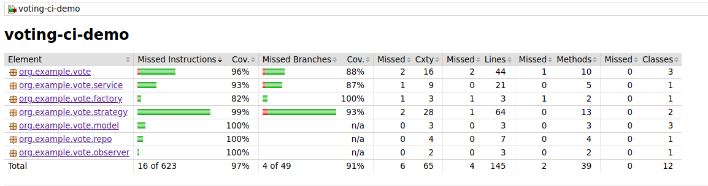
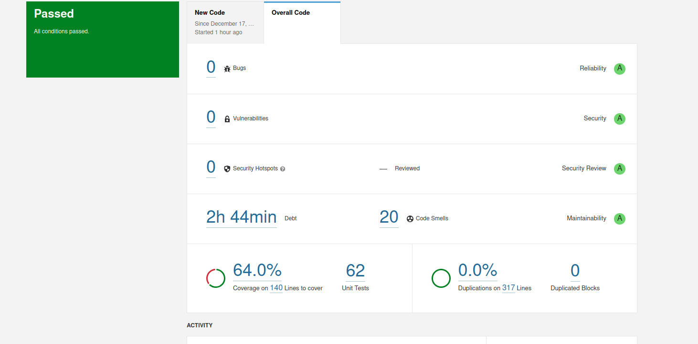
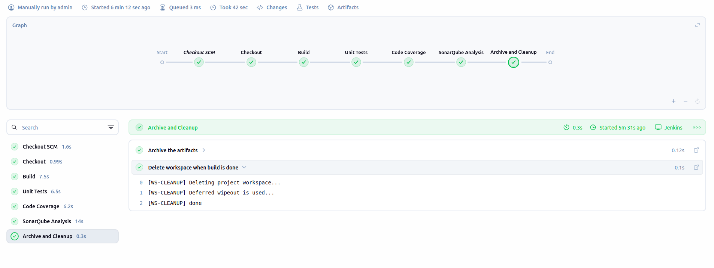

#                                      Voting CI Demo – Refactoring & DevOps Pipeline

## Présentation du projet

*Ce projet s’inscrit dans le cadre du module Ingénierie Logicielle à l’ENSA Marrakech. Il a pour objectif de transformer un code legacy de type spaghetti code en une application modulaire, testée et intégrée automatiquement dans une chaîne CI/CD. Le système étudié est une application simple de votes en ligne, utilisée comme support pédagogique pour le refactoring, l’application de Design Patterns et la mise en place d’un pipeline DevOps.*

## Objectifs du projet

- *Refactoriser un code monolithique difficilement maintenable*

- *Appliquer des Design Patterns pour améliorer la qualité logicielle*

- *Mettre en place des tests unitaires automatisés*

- *Configurer une pipeline d’intégration continue avec Jenkins*

- *Analyser la qualité du code avec SonarQube et JaCoCo*
## Design Patterns utilisés
*Trois Design Patterns principaux sont utilisés dans ce projet*: 

- *Le **Factory** Method permet la création dynamique des repositories sans couplage fort avec l’implémentation concrète.*

- *Le **Strategy** facilite la gestion de plusieurs algorithmes de comptage des votes*

- *Le **Observer** assure la notification des événements lors de l’ajout d’un vote.*

*Ces patterns garantissent une meilleure séparation des responsabilités, une extensibilité accrue et une testabilité améliorée.*
## Architecture du projet

L’application est structurée selon une architecture modulaire avec séparation claire des couches :

**Model** : entités métier (Vote, Candidate)

**Repository (DAO)** : persistance des données

**Service** : logique métier et orchestration

**Strategy** : algorithmes de dépouillement

**Observer** : notifications d’événements

**App** : point d’entrée CLI

## Technologies utilisées

*Le projet est développé en **Java 17** et utilise **Maven** pour la gestion du build et des dépendances. Les tests sont réalisés avec **JUnit 5**, et la couverture de code est mesurée avec **JaCoCo**. La qualité du code est analysée via **SonarQube**, et l’automatisation **CI/CD** est assurée par **Jenkins**.*
##  Structure du projet

```text
voting-ci-demo/
├─ pom.xml
├─ Jenkinsfile
├─ sonar-project.properties
├─ README.md
├─ src/
│  ├─ main/java/org/example/vote/
│  │  ├─ model/
│  │  ├─ repo/
│  │  ├─ factory/
│  │  ├─ service/
│  │  ├─ strategy/
│  │  ├─ observer/
│  │  └─ App.java
│  └─ test/java/org/example/vote/service/
│     └─ VoteServiceTest.java
└─ target/
```

## Exécution du projet
*Compilation et tests*
`mvn clean install`

*Lancement de l’application (CLI)*
`java -jar target/voting-ci-demo.jar`

## Tests unitaires

La couverture de code est générée automatiquement lors du build.

Rapport HTML : ``target/site/jacoco/index.html``

Seuil minimal requis : > 60%



## Analyse de la qualité – SonarQube

L’analyse SonarQube permet de vérifier :

*La qualité du code*

*Les duplications*

*Les bugs et code smells*

*Le respect du Quality Gate*

Commande :

``mvn sonar:sonar``



## Pipeline Jenkins

*La pipeline Jenkins automatise l’ensemble du processus d’intégration continue en exécutant plusieurs étapes clés. Elle commence par la récupération du code source, puis effectue le **build Maven** pour compiler le projet. Ensuite, elle lance l’exécution **des tests unitaires** afin de valider le bon fonctionnement du code. Une fois les tests passés, **la pipeline génère les rapports de couverture de code JaCoCo**, puis réalise l’analyse de la qualité du code avec **SonarQube**. Enfin, elle procède à la vérification du Quality Gate pour s’assurer que le code respecte les standards définis avant d’être intégré.*




# Contexte académique

**École** : Ecole Nationale des Sciences Appliquées

**Module** : Ingénierie Logicielle

**Filière** : Génie Informatique

**Année universitaire**: 2025/2026


# Auteur

- [Bahamd Imane](https://github.com/imanebahamd)
- [FADYL Ezzahra](https://github.com/EzzahraF)
- [KHALLOUFI Yousra](https://github.com/yousra-kh9)

## Encadrement
Projet encadré par : Professeur Bouarifi Walid
## Conclusion

*Le projet Voting CI Demo illustre l’importance du refactoring et de l’application des Design Patterns pour transformer un code legacy spaghetti en une application modulaire, testable et maintenable. Grâce à la mise en place d’une pipeline CI/CD avec Jenkins, à l’analyse de la qualité du code via SonarQube, et à la couverture de tests assurée par JaCoCo, le projet démontre comment automatiser efficacement l’intégration et le déploiement tout en garantissant la fiabilité du logiciel. Cette expérience pédagogique permet de renforcer les compétences en architecture logicielle, tests unitaires, modularité et pratiques DevOps, préparant ainsi les étudiants à des projets industriels complexes.*
